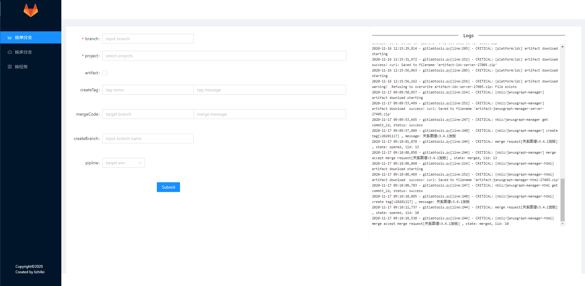

## Display


## Config
modify gitlab_domain & gitlab_token in src/config.json
```json
{
    "gitlab_domain":"git.iwellmass.com",
    "gitlab_token": "TM99wdzKSsZQJjPAL687",
    "apiServer":""
}
```
## Available Scripts

In the project directory, you can run:

### `sh start.sh`

### `sh stop.sh`


## Devlopment

### frontend
```shell
yarn install
yarn start
yarn build
```
### backend
```shell
python3 main.py
```

### compile file
```shell
python3 -m compileall *.py -qb
```

## If you use nginx to proxy, config like below:
```
server {
    listen       80;
    server_name  gitlabtool.iwellmass.com;
    location ~* / {
        proxy_set_header Connection '';
        proxy_http_version 1.1;
        chunked_transfer_encoding off;
        proxy_buffering off;
        proxy_cache off;
        proxy_pass              http://192.168.10.219:54320;
    }
```